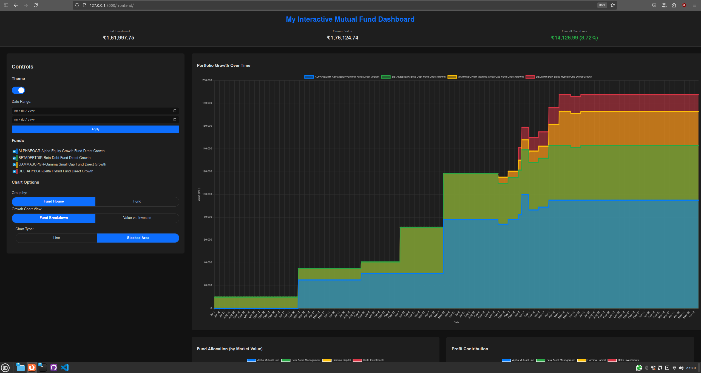
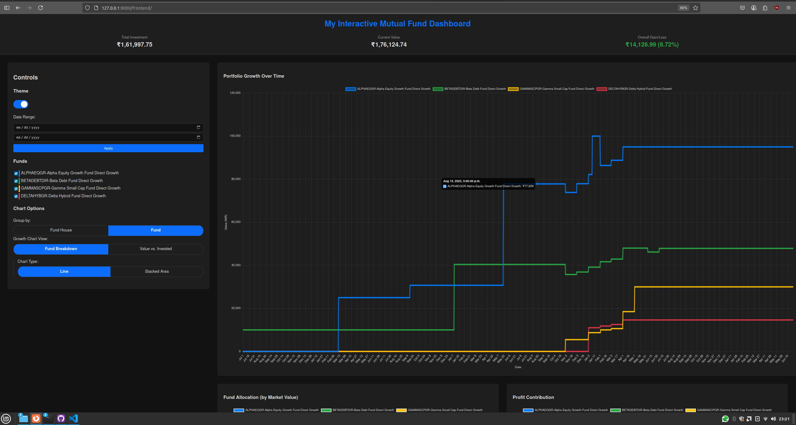
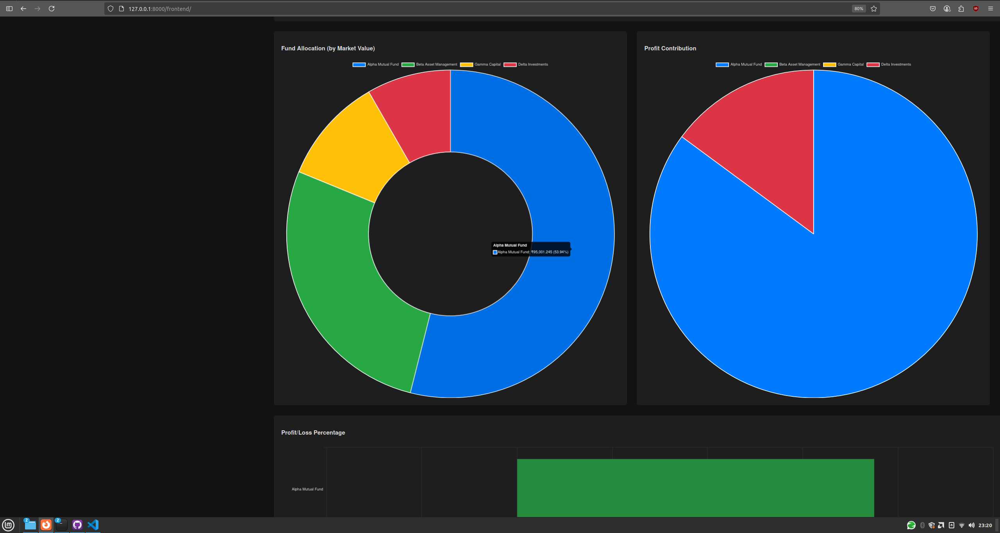
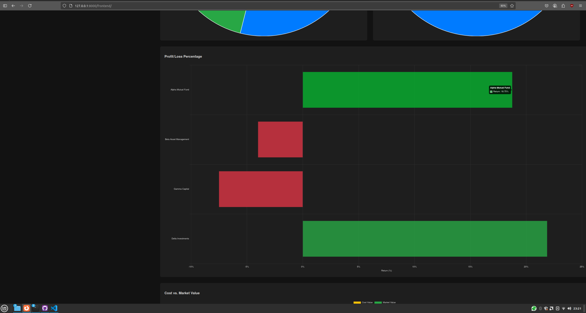
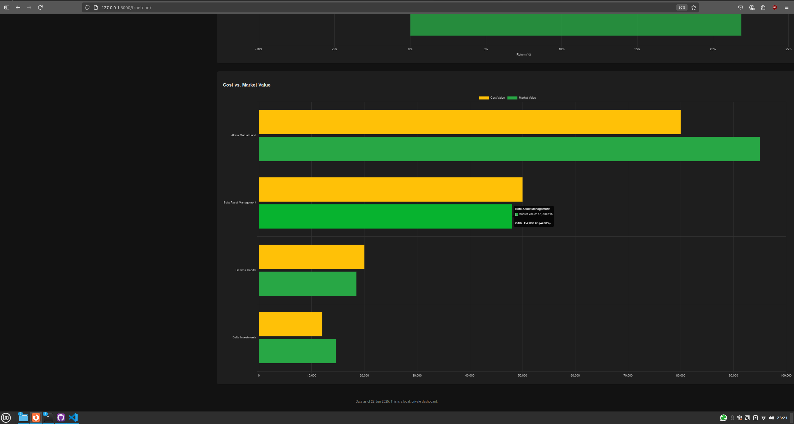

# Mutual Funds Dashboard - Vibe Coding Diaries

**Demo ready:** This repo includes dummy `data.json` and `snapshot_data_updated.jsonl` files. You can launch the dashboard and try all features instantly—no personal data or setup required!

👇 _Scroll down to the [Demo](#demo) section to see screenshots of the dashboard in action!_


An **interactive personal dashboard** to visualize and track your mutual fund investments. It consolidates data from **CAMS/KFintech Consolidated Account Statements (CAS)** and **monthly CDSL CAS** snapshots for a comprehensive portfolio overview.

---

## Features

* **Key Performance Indicators (KPIs):**

  * Total Investment
  * Current Value
  * Overall Gain/Loss

* **Interactive Charts:**

  * Portfolio Growth Over Time (by fund breakdown/value vs. invested, line/area chart)
  * Fund Allocation (by Market Value)
  * Profit Contribution
  * Profit/Loss Percentage by Fund/Fund House
  * Cost vs. Market Value by Fund/Fund House

* **Data Filtering:**

  * Filter by date range
  * Select/deselect specific funds

* **Customization:**

  * Group by Fund House or Fund
  * Light/Dark theme toggle

* **Data Consolidation:**

  * Merges detailed transaction history with periodic holding snapshots for a complete view

---

## Project Structure

```
rag-mutual-funds-dashboard/
├── frontend/
│   ├── app.js
│   ├── index.html
│   ├── style.css
│   └── assets/
│       └── favicon.svg
│
├── data/
│   ├── data.json                    # Dummy/sample CAMS/KFintech data (replace with your own for real analysis)
│   ├── snapshot_data_updated.jsonl  # Dummy/sample CDSL data
│
├── pipelines/
│   ├── cams_cas_extractor_prompt.txt
│   ├── CDSL_Mutual_Funds_Extractor.py
│   ├── decrypto.py
│   └── ... (other pipeline scripts/files)
```

---

## Technology Stack

* **Frontend:** HTML, CSS, JavaScript
* **Charting:** Chart.js (with `chartjs-adapter-date-fns`)
* **Data Processing:**

  * Python
  * PyMuPDF (Fitz): For PDF decryption
  * [olmocr](https://github.com/allenai/olmocr): OCR, PDF to Markdown
  * Large Language Models (LLMs):

    * Gemini (or similar): For extracting `data.json` from CAMS CAS
    * Local LLM Server (for CDSL extraction):

      * [`llama-server`](https://github.com/ggerganov/llama.cpp) from `llama.cpp` (OpenAI-compatible API server)
      * Optionally, use CLI tools like `llama-cli` for direct interaction
      * (Ollama is also supported)

---

## Setup & Prerequisites

1. **Python Environment**

   ```bash
   pip install pymupdf tqdm openai
   ```

2. **olmocr**

   * Install [olmocr](https://github.com/allenai/olmocr) per their docs.
   * Example:

     ```bash
     python -m olmocr.pipeline ./olmocr_workspace --markdown --pdfs ./cdsl_pdfs_for_olmocr/
     ```

3. **LLM Access**

   * For CAMS/KFintech (`data.json`): Any LLM (e.g., Gemini) that works with the prompt in `pipelines/cams_cas_extractor_prompt.txt` and your PDF text. (Prefer Gemini because of the longer context window)
   * For CDSL (`snapshot_data_updated.jsonl`):

     * Ensure you have a local OpenAI-compatible LLM server running.
     * **Options include:**

       * [`llama-server`](https://github.com/ggerganov/llama.cpp) from `llama.cpp` (`llama-server -m path/to/model.gguf`)
       * CLI tools like `llama-cli` (for direct CLI extraction workflows)
       * Ollama (if preferred)

4. **Web Server (Frontend)**

   * From the project root (`rag-mutual-funds-dashboard/`), run:

     ```bash
     python -m http.server
     ```

     * Then open `http://localhost:8000/frontend` in your browser to use the dashboard.

---

## Data Pipeline

The dashboard needs two main files:

### 1. `data.json` (CAMS/KFintech CAS)

* **Source:** Your consolidated CAMS/KFintech statement PDF
* **Process:**

  1. Decrypt with `pipelines/decrypto.py` if password protected.
  2. Use an LLM (e.g., Gemini) with `pipelines/cams_cas_extractor_prompt.txt` (upload the pdf using the files API of google's genai library, or use AI Studio GUI).
  3. Save the validated output as `data.json` in the data folder.

### 2. `snapshot_data_updated.jsonl` (CDSL CAS)

* **Source:** Monthly CDSL e-CAS PDFs (portfolio snapshots)
* **Process:**

  1. Decrypt PDFs with `pipelines/decrypto.py`.
  2. Convert to Markdown using `olmocr`:

     ```bash
     python -m olmocr.pipeline ./output_md_dir --markdown --pdfs ./decrypted_cdsls/
     ```
  3. Run `pipelines/CDSL_Mutual_Funds_Extractor.py` (with local LLM server running):

     ```bash
     python pipelines/CDSL_Mutual_Funds_Extractor.py
     ```
  4. The script extracts data from `.md` files and outputs sorted snapshots to `snapshot_data_updated.jsonl`.

---

### Adding New Data

**For new monthly CDSL CAS:**

1. Place encrypted PDF in `input_dir` for `decrypto.py` and run script.
2. Run `olmocr` to convert to Markdown.
3. Run `CDSL_Mutual_Funds_Extractor.py` to extract and update `snapshot_data_updated.jsonl`.

**To refresh CAMS CAS data (`data.json`):**

* Repeat CAMS steps with your latest PDF.

---

## Dashboard Usage

1. Ensure both `data.json` and `snapshot_data_updated.jsonl` are present in the `data/` folder and up to date.
2. Start a local server:

   ```bash
   python -m http.server
   ```
3. Open `/frontend` in your browser (`http://localhost:8000/frontend`).
4. Use controls to filter, switch charts, and toggle themes.

---

## Important Notes

* **Data Accuracy:**

  * This dashboard uses ISIN as a key to map between CDSL snapshots and CAMS/KFintech transaction records.
  * Due to OCR/LLM errors, ISINs may sometimes be misread (e.g., 'I' as '1', 'O' as '0'), which can result in duplicate or fragmented fund entries.
  * If you see the same fund showing up multiple times in the dashboard (especially with similar names/ISINs), check and manually clean the ISINs in your JSON files for consistency.
  * Extraction also depends on the quality of your source PDFs, OCR output, and LLM interpretation. Always cross-check key data for accuracy.

* **LLM Prompts:** Extraction quality relies on prompt design. Provided prompts may need adjustment for your LLM or statement formats.

* **Security:** Store all financial data locally and handle passwords carefully. Never share your `data.json` or PDFs.

* **Local LLM API:** The extractor script expects an OpenAI-compatible API (default: `http://127.0.0.1:8080/v1`).

---

## Demo

<div align="center">


<br>

<br>

<br>

<br>


</div>
